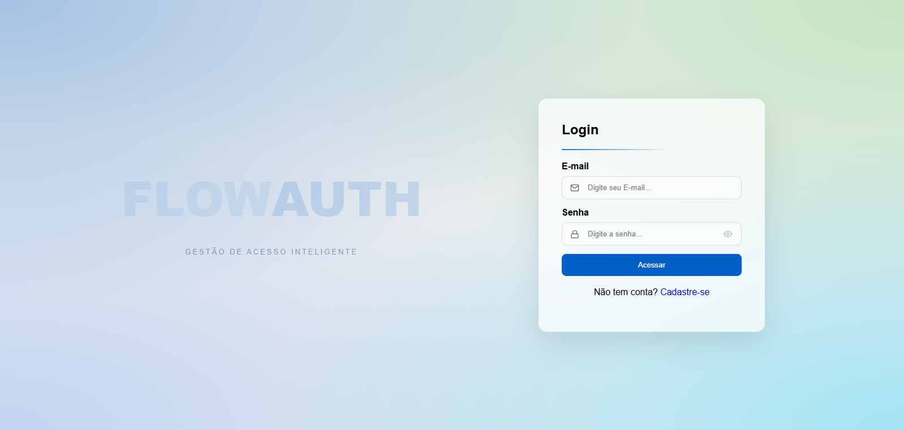
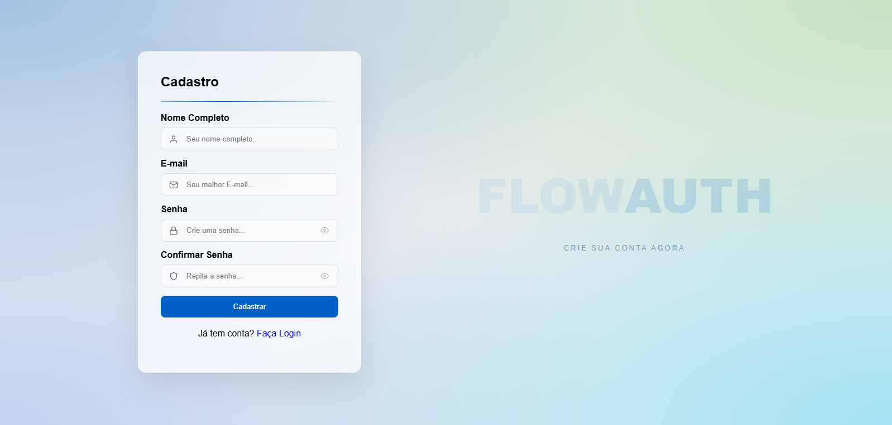

# 🛡️ FlowAuth - High-Fidelity Auth Interface

> **Uma interface de autenticação dinâmica de alta fidelidade, desenvolvida para proporcionar uma transição fluida entre estados de Login e Cadastro com foco em Motion Design e Glassmorphism.**

## 📖 Sobre o Projeto

O **FlowAuth** é uma interface de autenticação moderna que rompe com o padrão centralizado comum. O projeto utiliza um layout **Split-Screen Dinâmico**, onde o formulário viaja horizontalmente pela tela conforme a interação do usuário, criando um fluxo narrativo entre as ações de Login e Cadastro.

Com estética baseada em **Glassmorphism** e **Mesh Gradients**, o projeto foca na harmonia visual e em micro-interações de baixo impacto cognitivo.

---

## 🚀 Funcionalidades Implementadas

* **Split-Screen Motion:** Transição lateral fluida controlada via classes dinâmicas no `body`, movendo o formulário e o conteúdo de apoio de forma síncrona.
* **Glassmorphism UI:** Interface translúcida utilizando `backdrop-filter: blur` e bordas suaves, otimizada para se destacar sobre fundos complexos.
* **Iconografia Minimalista:** Implementação de **Feather Icons** com traços finos (`stroke-width: 1.5px`) para um visual *clean* e profissional.
* **Toggle Visibility (Ver Senha):** Funcionalidade de alternância de visibilidade de senha com troca dinâmica de estados e ícones.
* **Sanitização Dinâmica:** Filtro em tempo real no campo de nome (Regex) e validação rigorosa de igualdade de senhas e formato de e-mail.
* **Clean DOM & Erros:** Gerenciamento centralizado de erros que limpa o estado de alerta instantaneamente ao detectar nova entrada do usuário.

---

## 📸 Screenshots

|||
|:---:|:---:|
|**Login (Lado Direito)**|**Cadastro (Lado Esquerdo)**|

---

## 📐 Arquitetura e Design

O FlowAuth foi construído seguindo princípios modernos de design de interface:

* **Assimetria Equilibrada:** O uso do espaço vazio é preenchido por um título flutuante em baixa opacidade (**FlowAuth**), garantindo que a interface não pareça vazia enquanto o formulário ocupa as laterais.
* **Hierarquia Tipográfica:** Subtextos com `letter-spacing` aumentado e baixa opacidade para criar uma estética *premium* sem competir com as informações principais.
* **Resiliência Visual:** Sistema de cores baseado em variáveis e RGBA, garantindo que o efeito de vidro funcione sobre qualquer variação do gradiente de fundo.

---

## 🛠️ Stack Tecnológica

| Tecnologia | Aplicação no Projeto |
| :--- | :--- |
| **HTML5** | Estruturação semântica e wrappers de isolamento para ícones e campos. |
| **CSS3** | Mesh Gradients, Flexbox dinâmico, Glassmorphism e Motion Design. |
| **JavaScript** | Lógica de navegação de estados, Toggle de visibilidade e validações ES6+. |
| **Feather Icons** | Biblioteca de ícones vetoriais focada em traços finos e minimalismo. |

---

## 📂 Como Executar o Projeto

O projeto é 100% front-end e pode ser executado instantaneamente:

1. Clone este repositório.
2. Mantenha o `index.html` e o `estilo.css` no mesmo diretório.
3. Abra o arquivo `index.html` no navegador.

> **💡 Dica de Dev:** Recomenda-se o uso de navegadores baseados em Chromium para a melhor renderização do efeito de `backdrop-filter` (Blur).

---

## 📝 Roadmap de Evolução

- [x] Transições suaves e Split-Screen.
- [x] Ícones minimalistas e refinamento de cores.
- [x] Funcionalidade de "Ver Senha" (*Toggle Visibility*).
- [ ] **Backend:** Integração com serviço de autenticação via API REST.
- [ ] **Social Auth:** Botões de login via OAuth (Google/GitHub).

---

## 🤝 Contribuição

Feedbacks sobre usabilidade, acessibilidade e performance das animações são sempre bem-vindos!

---

## 📝 Autor

Desenvolvido por **[Mateus Lima](https://www.linkedin.com/in/mateuslima-santos)**.