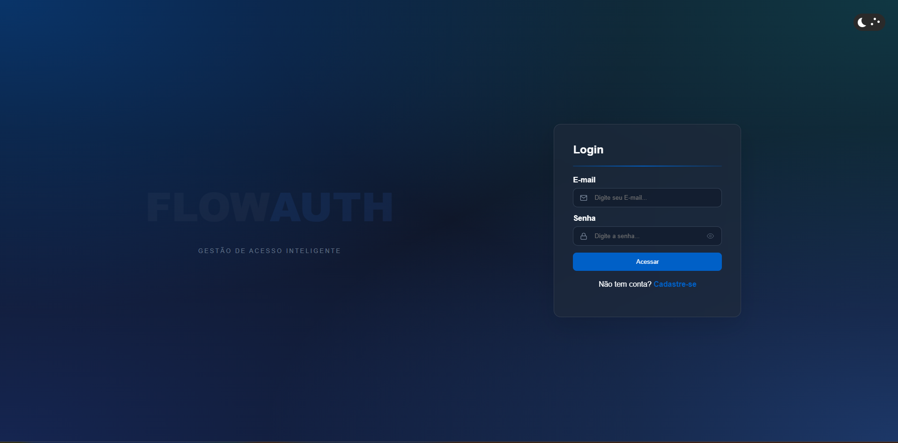

# 🛡️ FlowAuth - High-Fidelity Auth Interface

> **Uma interface de autenticação dinâmica de alta fidelidade, desenvolvida para proporcionar uma transição fluida entre estados de Login e Cadastro com foco em Motion Design, Glassmorphism e persistência de tema.**

**Link para o Formulário de Acesso:** [Modo Live do Formulário](https://mateuslima909.github.io/formulario-de-acesso/)

## 📖 Sobre o Projeto

O **FlowAuth** é uma interface de autenticação moderna que rompe com o padrão centralizado comum. O projeto utiliza um layout **Split-Screen Dinâmico**, onde o formulário viaja horizontalmente pela tela conforme a interação do usuário. 

Nesta versão atualizada, o projeto implementa um sistema de **Dual Theme (Light/Dark Mode)** com persistência de dados, garantindo que a preferência do usuário seja respeitada em futuras sessões.

---

## 🚀 Funcionalidades Implementadas

* **Dual Theme Engine:** Sistema de troca de temas (Claro/Escuro) utilizando variáveis CSS (`:root`) para uma transição de cores suave e performática.
* **Theme Persistence:** Integração com `localStorage` para salvar a preferência de tema do usuário no navegador.
* **Modular Code Architecture:** Refatoração completa para separação de responsabilidades (HTML, CSS e JS em arquivos e pastas distintas), facilitando a manutenção e escalabilidade.
* **Split-Screen Motion:** Transição lateral fluida controlada via `classList` no JavaScript, evitando conflitos de estado entre o layout e o tema.
* **Glassmorphism UI:** Interface translúcida utilizando `backdrop-filter: blur`, otimizada tanto para paletas claras quanto para tons escuros (Cyberpunk Blue).
* **Animated Theme Switcher:** Toggle customizado com animações de astros (sol, lua e estrelas) para uma experiência de usuário lúdica.
* **Toggle Visibility (Ver Senha):** Alternância de visibilidade com troca dinâmica de ícones Feather.

---

## 📸 Screenshots

|||
|:---:|:---:|
|**Interface - Light Mode**|**Interface - Dark Mode**|

---

## 📐 Arquitetura e Design

O FlowAuth utiliza conceitos avançados de estruturação Front-end:

* **Variáveis CSS Dinâmicas:** Gerenciamento de cores através de tokens CSS, permitindo que o tema escuro seja ativado apenas alternando uma classe no `body`.
* **Motion Design:** Uso de curvas `cubic-bezier` para garantir que o movimento do formulário e do texto lateral pareça natural e orgânico.
* **Sanitização de Inputs:** Lógica de validação em tempo real e tratamento de erros via DOM traversal (`closest` e `querySelector`).

---

## 🛠️ Stack Tecnológica e Estrutura

| Tecnologia | Aplicação no Projeto |
| :--- | :--- |
| **HTML5** | Estruturação semântica e organização modular. |
| **CSS3** | Variáveis nativas, Glassmorphism e animações complexas. |
| **JavaScript** | Manipulação do DOM, persistência em LocalStorage e lógica de estados. |
| **Feather Icons** | Iconografia vetorial ultra-fina para um design minimalista. |

**Estrutura de Pastas:**
- `/assets`: Recursos visuais e favicons.
- `/script`: Lógica JavaScript modularizada.
- `/static`: Estilização CSS centralizada.
- `index.html`: Ponto de entrada do sistema.

---

## 📂 Como Executar o Projeto

Graças à nova arquitetura modular, basta clonar a estrutura de pastas completa:

1. Clone este repositório.
2. Certifique-se de que as pastas `script`, `static` e `assets` estão no mesmo nível do `index.html`.
3. Abra o arquivo `index.html` no seu navegador de preferência.

---

## 📝 Roadmap de Evolução

- [x] Separação de arquivos (HTML/CSS/JS).
- [x] Implementação de Dark Mode com persistência (`localStorage`).
- [x] Toggle de visibilidade de senha.
- [ ] **Backend:** Integração com serviço de autenticação via API REST (Node.js/Spring).
- [ ] **Social Auth:** Botões de login via OAuth (Google/GitHub).

---

## 🤝 Contribuição

Feedbacks sobre a fluidez das animações e a legibilidade do código são sempre bem-vindos!

---

## 📝 Autor

Desenvolvido por **[Mateus Lima](https://www.linkedin.com/in/mateuslima-santos)**.
